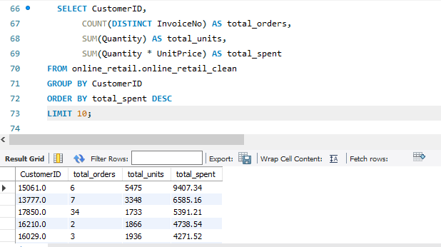

# Online Retail SQL Analysis

## Project Type
End-to-End SQL Data Analysis Project

## Project Objective

The goal of this project is to analyze retail transaction data to uncover sales patterns, customer behavior, and business opportunities using SQL.

## Business Questions

- Which products generate the most revenue?
- Who are the highest value customers?
- Which countries drive the most sales?
- Is there any seasonal trend in sales?

 ## The dataset contains:

-Invoice numbers
-Product details
-Customer IDs
-Quantity and price
-Country information

## SQL Skills Demonstrated

- Data cleaning
- Filtering and conditional logic
- Aggregation (SUM, COUNT)
- Grouping and sorting
- Case statements for segmentation
- Date formatting and time analysis

## ## Project Workflow

* Removed records with missing product descriptions
* Removed records with missing customer IDs
* Excluded canceled transactions (InvoiceNo starting with 'C')
* Removed negative quantities (returns)

Clean dataset: 9,336 records from 12,959 total rows

## Analysis Performed

### 1. Top Products by Revenue

| Product                            | Revenue (£) |
| ---------------------------------- | ----------- |
| REGENCY CAKESTAND 3 TIER           | 5567.40     |
| BLACK RECORD COVER FRAME           | 3868.35     |
| WHITE HANGING HEART T-LIGHT HOLDER | 2806.30     |
| CHILLI LIGHTS                      | 2399.04     |
| RED WOOLLY HOTTIE WHITE HEART.     | 2394.00     |

### 2. Customer Segmentation

Customers were grouped based on total spending:

* High Value (≥ 5000)
* Mid Value (2000 – 4999)
* Low Value (< 2000)

Top Customers:

* Customer 15061 → £9407.34 (High Value)
* Customer 13777 → £6585.16 (High Value)
* Customer 17850 → £5391.21 (High Value)
* Customer 16210 → £4738.54 (Mid Value)
* Customer 16029 → £4271.52 (Mid Value)

### 3. Country-Level Insights

* United Kingdom dominates sales and revenue
* Other countries contribute smaller but meaningful sales
* Some countries show bulk buying behavior

### 4. Time-Based Analysis

* All transactions fall within December 2010
* Total Sales: £175,354.24
* Total Orders: 477
* Sales peak during the holiday season

## Key Insights

* A small number of products generate the majority of revenue
* High-value customers contribute significantly to total sales
* The United Kingdom is the dominant market
* Some countries show bulk purchasing behavior
* Sales are highly seasonal, with peak performance in December

* ## Business Recommendations

* Focus retention strategies on high-value customers
* Promote top-performing products to increase revenue
* Expand marketing efforts to international markets
* Prepare inventory ahead of December peak periods
* Review low-performing products for improvement or removal

* ## SQL Queries

All SQL queries used for this analysis are available in:

* online_retail_analysis.sql

The queries are structured into:

* Data cleaning
* Feature creation
* Product analysis
* Customer segmentation
* Country analysis
* Time-based analysis

## Tools Used

* MySQL Workbench
* SQL

 ## Top Products by Revenue

 

## Customer Segmentation

## Conclusion

This project shows how SQL can be used to clean data and generate real business insights from raw transactional data.
